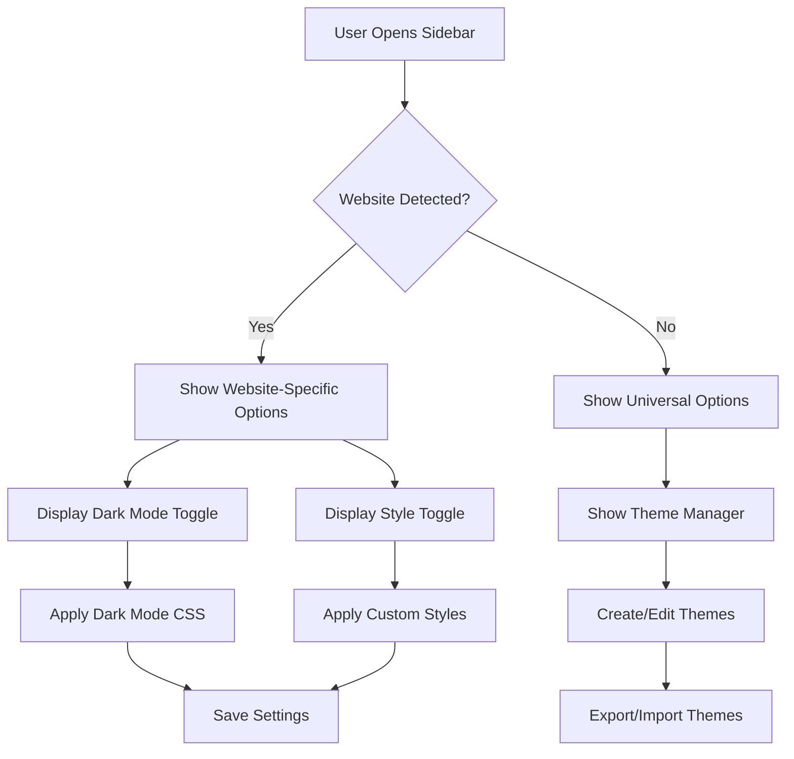

## 1. Product Overview
Theme Hub is a Chrome extension that allows users to inject custom CSS and JavaScript into websites to customize their appearance and functionality. Users can apply dark mode, custom styles, and themes to any website with simple toggle controls.

The extension solves the problem of inconsistent theming across websites and gives users control over their browsing experience. It's designed for users who want to personalize their web experience with custom styles and dark mode support.

## 2. Core Features

### 2.1 User Roles
| Role | Registration Method | Core Permissions |
|------|---------------------|------------------|
| Extension User | Chrome Web Store installation | Can use all extension features, create custom themes, toggle styles |

### 2.2 Feature Module
Theme Hub requirements consist of the following main components:
1. **Sidebar Interface**: Main extension panel with website-specific toggles and theme management
2. **Theme Manager**: Custom CSS/JS injection system with per-website organization
3. **Dark Mode Engine**: Automatic dark mode detection and injection system
4. **Quick Access**: Keyboard shortcuts for fast theme switching
5. **Multi-language Support**: Interface available in 6 languages (English, Spanish, French, German, Portuguese, Polish)

### 2.3 Page Details
| Component | Module Name | Feature description |
|-----------|-------------|---------------------|
| Sidebar Interface | Website Detection | Automatically detect current website and show relevant theme options |
| Sidebar Interface | Toggle Controls | Show/hide style toggle and dark mode toggle based on website support |
| Sidebar Interface | Theme Preview | Display live preview of applied themes before saving |
| Theme Manager | Custom CSS Editor | Code editor for creating and editing custom CSS styles |
| Theme Manager | JavaScript Injector | Add custom JavaScript functionality to websites |
| Theme Manager | Theme Storage | Save and organize themes by website domain |
| Theme Manager | Import/Export | Share theme configurations with other users |
| Dark Mode Engine | Auto Detection | Detect if website already has dark mode support |
| Dark Mode Engine | CSS Injection | Apply dark mode styles when toggle is activated |
| Dark Mode Engine | Smart Inversion | Intelligently invert colors while preserving important elements |
| Quick Access | Keyboard Shortcuts | Assign hotkeys for common theme actions |
| Quick Access | Quick Toggle | One-click theme switching from any page |
| Multi-language | Language Selector | Choose interface language from dropdown |
| Multi-language | Dynamic Translation | All UI elements translate instantly on language change |

## 3. Core Process
**User Flow:**
1. User installs extension from Chrome Web Store
2. Extension appears as sidebar icon in Chrome
3. User navigates to any website (e.g., CBS News)
4. Opens sidebar - extension detects website automatically
5. Shows available toggles (Dark Mode, Custom Styles) for that specific site
6. User can toggle dark mode or apply custom CSS themes
7. Changes apply instantly to the current website
8. Settings persist for future visits to the same site

**Theme Creation Flow:**
1. User opens theme manager in sidebar
2. Selects target website or creates universal theme
3. Writes custom CSS/JavaScript in built-in editor
4. Tests theme with live preview
5. Saves theme for automatic injection on website visits

## 4. User Interface Design

### 4.1 Design Style
- **Primary Colors**: Deep purple (#6B46C1) for primary actions, dark gray (#1F2937) for backgrounds
- **Secondary Colors**: Light gray (#F3F4F6) for cards, white for content areas
- **Button Style**: Rounded corners (8px radius), subtle shadows, hover effects
- **Font**: Inter font family, 14px base size, clear hierarchy
- **Layout**: Card-based design with clear sections, consistent spacing (8px grid)
- **Icons**: Lucide React icons, consistent line weight and style

### 4.2 Page Design Overview
| Component | Module Name | UI Elements |
|-----------|-------------|-------------|
| Sidebar | Header | Extension logo, website name, minimize button |
| Sidebar | Toggle Section | Large toggle switches for Dark Mode and Styles, status indicators |
| Sidebar | Theme Preview | Live preview card showing current theme effects |
| Sidebar | Quick Actions | Keyboard shortcut hints, theme manager button |
| Theme Manager | Code Editor | Syntax-highlighted CSS/JS editor with line numbers |
| Theme Manager | File Browser | Tree view of website-specific theme folders |
| Theme Manager | Action Buttons | Save, Test, Export, Import buttons with icons |

### 4.3 Responsiveness
- **Desktop-first design** optimized for Chrome sidebar (320px width)
- **Touch-friendly** toggle controls and buttons for tablet users
- **Responsive layout** adapts to different sidebar sizes
- **Keyboard navigation** fully supported for accessibility