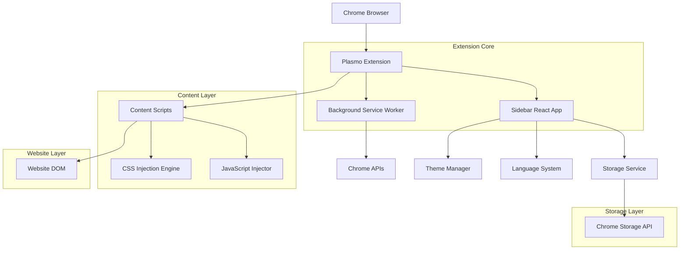
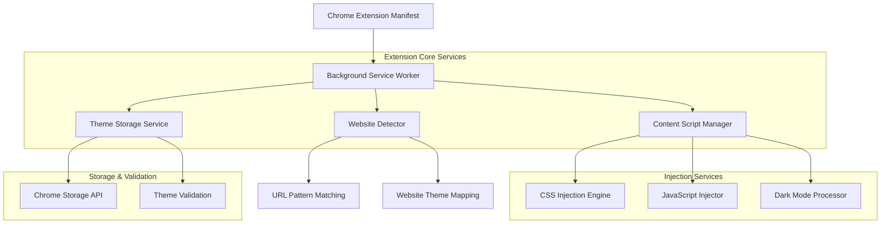
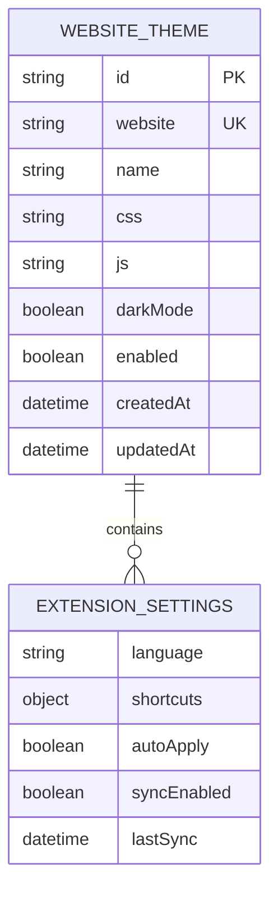

## 1. Architecture Design



## 2. Technology Description

* **Extension Framework**: Plasmo Framework v0.84.0+ with TypeScript

* **Frontend**: React 18 + TypeScript + Tailwind CSS

* **Build Tool**: Plasmo CLI (Vite-based)

* **Styling**: Tailwind CSS v3 with PostCSS and Autoprefixer

* **Icons**: Lucide React for consistent iconography

* **Code Quality**: ESLint with TypeScript support

* **Storage**: Chrome Storage API (local and sync)

* **Language Support**: i18next for multi-language support

* **Development**: TSX for TypeScript React components

## 3. Route Definitions

| Route                                 | Purpose                                     |
| ------------------------------------- | ------------------------------------------- |
| chrome-extension://\[id]/sidebar.html | Main sidebar interface for theme management |
| chrome-extension://\[id]/options.html | Extension options and settings page         |
| chrome-extension://\[id]/editor.html  | Standalone CSS/JS editor for advanced users |

## 4. Core API Definitions

### 4.1 Chrome Extension APIs

**Content Script Communication**

```typescript
interface ContentScriptMessage {
  type: 'THEME_APPLY' | 'THEME_REMOVE' | 'DARK_MODE_TOGGLE';
  payload: {
    website: string;
    themeId?: string;
    css?: string;
    js?: string;
  };
}
```

**Storage Interface**

```typescript
interface ThemeStorage {
  themes: Record<string, WebsiteTheme>;
  settings: ExtensionSettings;
}

interface WebsiteTheme {
  id: string;
  website: string;
  name: string;
  css: string;
  js?: string;
  darkMode: boolean;
  enabled: boolean;
  createdAt: Date;
  updatedAt: Date;
}

interface ExtensionSettings {
  language: 'en' | 'es' | 'fr' | 'de' | 'pt' | 'pl';
  keyboardShortcuts: Record<string, string>;
  autoApply: boolean;
  syncEnabled: boolean;
}
```

### 4.2 Theme Injection API

**CSS Injection**

```typescript
interface CSSInjector {
  inject(css: string, website: string): void;
  remove(website: string): void;
  update(css: string, website: string): void;
}
```

**JavaScript Injection**

```typescript
interface JSInjector {
  inject(js: string, website: string): void;
  remove(website: string): void;
  execute(js: string): Promise<any>;
}
```

## 5. Server Architecture Diagram



## 6. Data Model

### 6.1 Theme Data Structure



### 6.2 Chrome Storage Schema

**Theme Storage (chrome.storage.local)**

```typescript
interface ThemeStorageSchema {
  themes: {
    [website: string]: {
      id: string;
      name: string;
      css: string;
      js?: string;
      darkMode: boolean;
      enabled: boolean;
      createdAt: string;
      updatedAt: string;
    }
  };
  
  settings: {
    language: string;
    shortcuts: {
      toggleDarkMode: string;
      toggleStyles: string;
      openSidebar: string;
    };
    autoApply: boolean;
    syncEnabled: boolean;
  };
  
  websiteMappings: {
    [domain: string]: {
      patterns: string[];
      themes: string[];
    }
  };
}
```

### 6.3 File Structure

```
theme-hub/
├── src/
│   ├── background/
│   │   ├── index.ts
│   │   ├── message-handler.ts
│   │   └── storage-service.ts
│   ├── content-scripts/
│   │   ├── injector.ts
│   │   ├── css-processor.ts
│   │   └── js-executor.ts
│   ├── sidebar/
│   │   ├── components/
│   │   ├── hooks/
│   │   ├── utils/
│   │   └── App.tsx
│   ├── themes/
│   │   ├── websites/
│   │   │   ├── cbs-news.css
│   │   │   ├── nytimes.css
│   │   │   └── universal.css
│   │   ├── dark-mode/
│   │   │   ├── processor.ts
│   │   │   └── styles/
│   │   └── editor/
│   │       ├── CodeEditor.tsx
│   │       └── syntax-highlighter.ts
│   ├── i18n/
│   │   ├── en.json
│   │   ├── es.json
│   │   ├── fr.json
│   │   ├── de.json
│   │   ├── pt.json
│   │   └── pl.json
│   └── utils/
│       ├── website-detector.ts
│       ├── theme-validator.ts
│       └── keyboard-shortcuts.ts
├── assets/
│   ├── icons/
│   └── manifest.json
├── package.json
├── tsconfig.json
├── tailwind.config.js
└── plasmo.config.ts
```

### 6.4 Manifest Configuration

```json
{
  "manifest_version": 3,
  "name": "Theme Hub",
  "version": "1.0.0",
  "description": "Inject custom CSS and JavaScript into websites with dark mode support",
  "permissions": [
    "storage",
    "activeTab",
    "scripting",
    "sidePanel"
  ],
  "host_permissions": [
    "<all_urls>"
  ],
  "background": {
    "service_worker": "src/background/index.ts"
  },
  "content_scripts": [
    {
      "matches": ["<all_urls>"],
      "js": ["src/content-scripts/injector.ts"],
      "run_at": "document_start"
    }
  ],
  "side_panel": {
    "default_path": "sidebar.html"
  },
  "action": {
    "default_title": "Open Theme Hub"
  }
}
```

